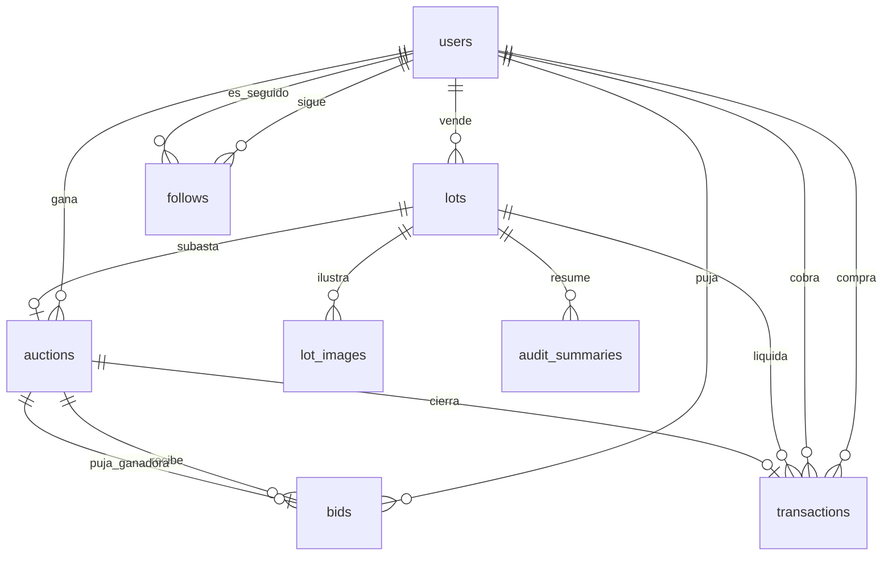
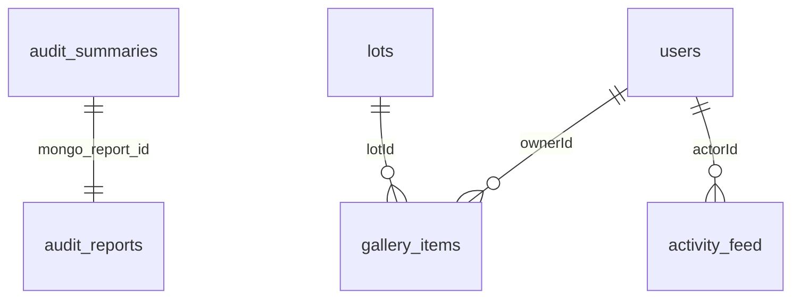

# Modelo de datos

Postgres guarda lo que debe ser consistente bajo una transacción (cuentas, lotes, pujas, liquidación). Mongo guarda documentos de auditoría, la galería y el feed. La referencia cruzada es un UUID. No hay una transacción que abarque los dos motores: primero se confirma Postgres y después se escribe Mongo.

El visitante no tiene fila en `users`. Los roles persistidos son `USER`, `SELLER` y `ADMIN`.

## Relacional

| Tabla | Papel |
|---|---|
| `users` | Cuenta, rol y visibilidad del perfil. El correo se guarda en minúsculas. |
| `lots` | Obra y su ciclo `BORRADOR → PENDIENTE_AUDITORIA → APROBADO \| REVISION_MANUAL → EN_SUBASTA → CERRADO`. |
| `lot_images` | Clave del objeto en Cloud Storage, orden y hash perceptual. El binario no está aquí. |
| `auctions` | Una subasta por lote. `ends_at` es el cierre vigente; `initial_ends_at` no se mueve con el anti-sniping. |
| `bids` | Puja con `idempotency_key` único. `winning_bid_id` en la subasta apunta a la puja ganadora. |
| `transactions` | Como máximo una liquidación por subasta. Comprador y vendedor son distintos. |
| `audit_summaries` | Score, rango de precio y veredicto. `mongo_report_id` apunta al informe completo. |
| `follows` | Arista dirigida. Una cuenta no puede seguirse a sí misma. |

Transiciones de lote que el servicio de catálogo debe respetar:

- `BORRADOR` → `PENDIENTE_AUDITORIA`
- `PENDIENTE_AUDITORIA` → `APROBADO` o `REVISION_MANUAL`
- `REVISION_MANUAL` → `APROBADO` o `BORRADOR`
- `APROBADO` → `EN_SUBASTA`
- `EN_SUBASTA` → `CERRADO`

`current_price` no puede bajar y `ends_at` no puede adelantarse. Lo impone el trigger `auctions_reject_backward_update`, no el cliente.

## Documentos

| Colección | Papel |
|---|---|
| `audit_reports` | Modelo, versión de prompt, entrada, hallazgos y fecha. `summaryId` es único y corresponde a `audit_summaries.id`. |
| `gallery_items` | Obra propia, ganada o gratuita. La visibilidad es `PUBLIC` o `PRIVATE` por pieza. |
| `activity_feed` | Verbos `PUBLISH`, `BID`, `WIN`, `FOLLOW`, `AUDIT`. El muro público filtra `visibility = PUBLIC`. |
| `event_logs` | Bitácora técnica con `correlationId`. Un índice TTL borra documentos a los 90 días. |

Una obra con `gallery_items.visibility = PRIVATE` o `lots.visibility = PRIVATE` no entra en los índices de lectura pública (`lots_public_catalog_idx`, `gallery_items_public_owner`).
